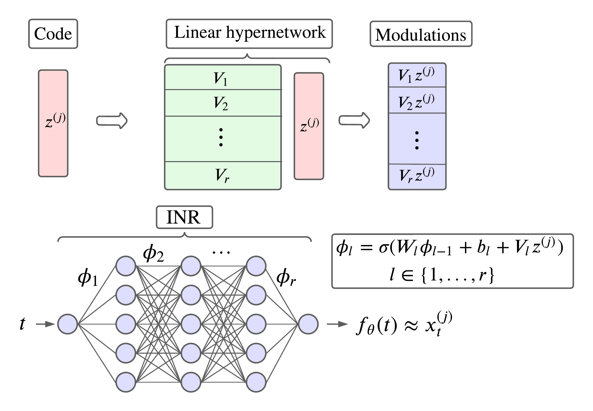

# Repository for the paper : "Time Series Continuous Modeling for Imputation and Forecasting with Implicit Neural Representations"

## Folders and files overview

- data folder: Contains a small subpart of the Electricity dataset specifically prepared for classical imputation and forecasting experiments.
- experiments folder: Includes the necessary files for training the models and performing inference for both imputation and forecasting tasks.
- save_models folder: Serves as a storage location for saving the trained models once they have been trained.
- src folder: Contains the network architecture and the metalearning procedure required for the experiments.

## How to run the experiments 

First, you should go to the experiments folder, then, it depends if  you want to run an imputation experiment or forecast experiment.

### Imputation experiment

1. Navigate to the training folder.
2. Open the file "inr_imputation.sh".
3. Choose the desired parameters for training:
    - Select the "draw_ratio" from the options: {0.05, 0.10, 0.20, 0.30, 0.50}.
    - Choose the "version" from the options: {0, 1}.
    - Note: Lower "draw_ratio" values allow for increasing the "sample_ratio_batch" ratio to speed up training.
    - Recommendation: Keep other parameters the same as proposed in the appendix.
4. Run the file using the command: $bash inr_imputation.sh (GPU usage is strongly encouraged for faster training).
5. Once the model is trained, it will be saved in the save_models folder.
6. To perform inference, go to the inference folder and open the "inference_forecast.sh" file.
7. Set the appropriate parameters used for training (dataset name, draw_ratio, epochs, version).
8. Run the file using the command: $bash inference_imputation.sh, and the forecast MAE score will be displayed

### Forecast experiment

1. Navigate to the training folder.
2. Open the file "inr_forecast.sh".
3. Choose the desired parameters for training:
    - Select the "horizon" from the options: {96, 192, 336, 720}.
    - Choose the "version" from the options: {0, 1}.
    - Note: Higher "horizon" values allow for decreasing the "horizon_ratio" ratio to speed up training.
    - Recommendation: Keep other parameters the same as proposed in the appendix.
4. Run the file using the command: $bash inr_forecast.sh (GPU usage is strongly encouraged for faster training).
5. Once the model is trained, it will be saved in the save_models folder.
6. To perform inference, navigate to the inference folder and open the "inference_forecast.sh" file.
7. Set the appropriate parameters used for training (dataset name, horizon, epochs, version).
8. Run the file using the command: $bash inference_forecast.sh, and the forecast MAE score will be displayed.
